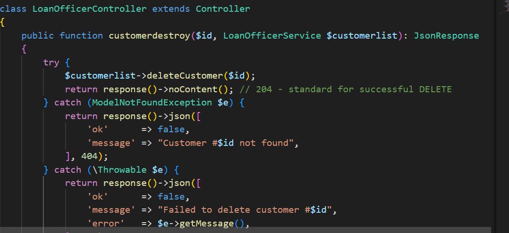
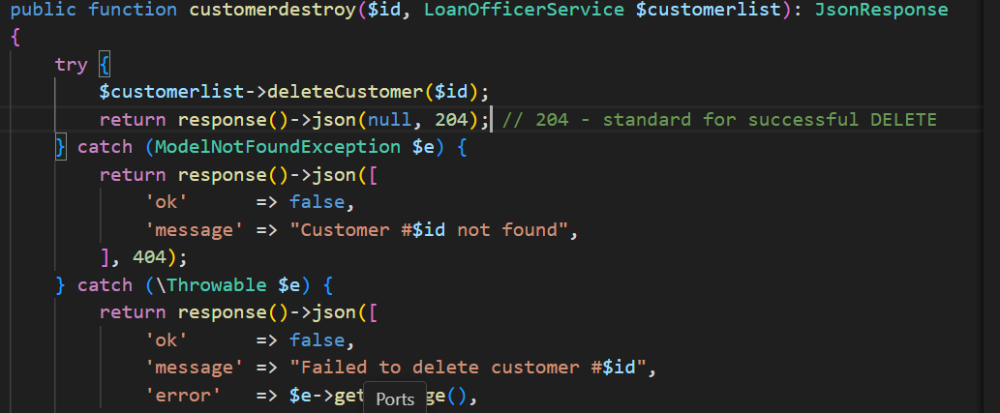
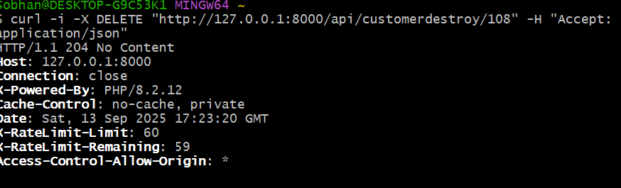
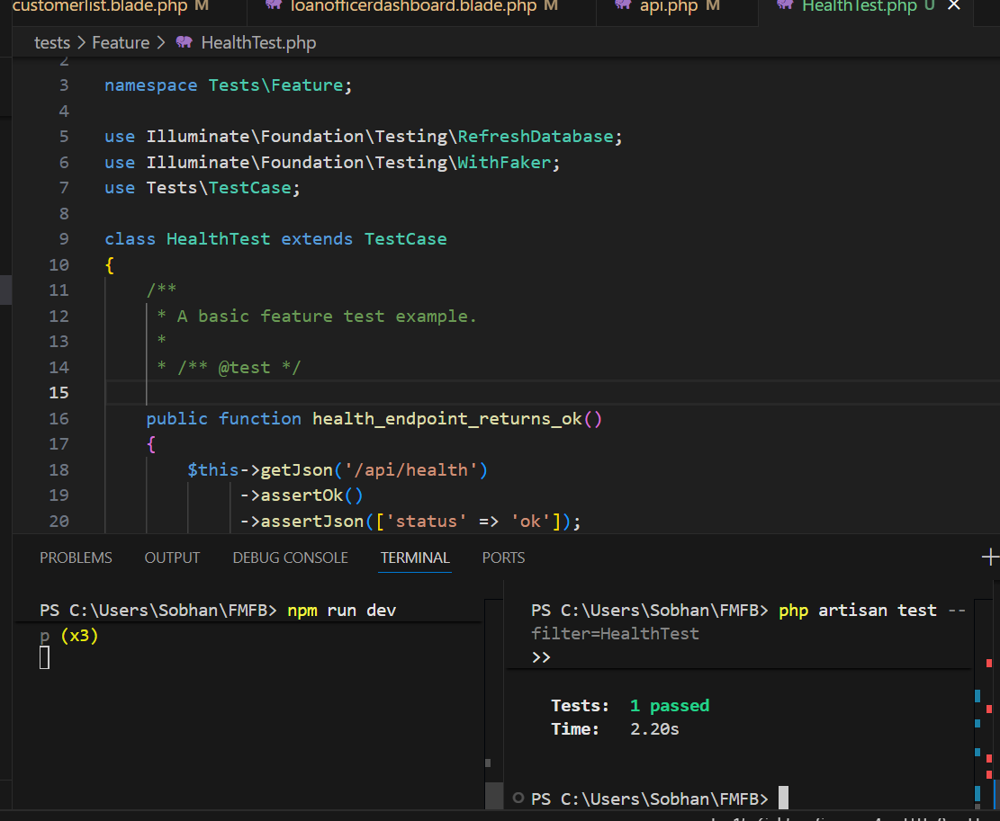

## 📅 Daily Progress Log


**📆 Date:** 2025-09-09  
**🛠️ Task:** What is REST FULL API and why should be used.

**🔍 Evidence:**
-   Branch: `docs/rest-basics`
-   Draft PR: N/A
-   Test Output:
    ```bash
    # reading & notes day, no tests
    ```

**📝 Notes:**  
Learnt what “stateless” means in REST, why REST returns resource representations, and why DELETE typically returns **204 No Content** on success. Also noted that Laravel’s API routes live under `/api` using the `api` middleware group.

---

- # Resource:
- A resource is anything that can be identified and manipulated over the web.
- Example: a user, a blog post, a photo, or even “today’s weather.
- # Representation:
- A representation is a snapshot / picture / encoding of the current state of a resource, in a format the client can understand — often JSON, XML, HTML, etc.
- State refers to the set of information / values a resource has right now. Think of it like the fields in a user record: name, email, etc., at the moment you asked for it.
- # stateless means in REST:
- In REST (Representational State Transfer), stateless means that each request from a client to the server must contain all the information needed for the server to understand and process it.
- # why REST returns resource representations:
- still learning
- # Why DELETE typically returns 204 No Content on success:
- The HTTP status code 204 No Content means: the server successfully processed the request, but is not returning any content in the response body.
- For DELETE requests, once the resource is removed, there’s often nothing useful to return (no updated representation, no content), so 204 is appropriate—it says “OK, done,” without sending unnecessary data. It keeps the response lightweight.

---

**📆 Date:** 2025-09-10  
**🛠️ Task:** Create minimal DELETE endpoint (route + controller + service)

**🔍 Evidence:**
-   Branch: `feature/api-delete-customer`
-   Draft PR: N/A
-   Test Output:
- by using : return response()->nocontent();

- The following  return type mismatch error: 
    ```bash
    php artisan route:list | grep customerdestroy
    DELETE  api/customerdestroy/{id}  ...  App\Http\Controllers\Api\LoanOfficerController@customerdestroy

    curl -i -X DELETE "http://127.0.0.1:8000/api/customerdestroy/116" -H "Accept: application/json"
    HTTP/1.1 500 Internal Server Error
    {"ok":false,"message":"Failed to delete customer #116","error":"... Return value must be of type JsonResponse, Response returned"}
    ```
- By using return respons->json();


- The retun type mismatch has been solved:


**📝 Notes:**  
Initial implementation worked through the stack, but response type mismatch surfaced (we returned `noContent()` which is a `Response` while action was typed `JsonResponse`). 

---

**📆 Date:** 2025-09-11  
**🛠️ Task:** Fix controller return + start FK cleanup (business_info)

**🔍 Evidence:**
-   Branch: `fix/controller-return-204`
-   Draft PR: N/A
-   Test Output:
    ```bash
    # Controller change
    # before: return response()->noContent();
    # after:
    return response()->json(null, 204);

    curl -i -X DELETE "http://127.0.0.1:8000/api/customerdestroy/3" -H "Accept: application/json"
    HTTP/1.1 500
    {"ok":false,"message":"Failed to delete customer #3","error":"... foreign key constraint fails (`fmfbdb`.`business_info` ...)"}

    -- SQL (business_info) --
    ALTER TABLE fmfbdb.business_info
      DROP FOREIGN KEY fk_business_customer;
    ALTER TABLE fmfbdb.business_info
      ADD CONSTRAINT fk_business_customer
      FOREIGN KEY (customer_id) REFERENCES fmfbdb.customer_tbl(customer_id)
      ON DELETE CASCADE ON UPDATE CASCADE;
    ```

**📝 Notes:**  
The 1451 FK violation appeared; fixed `business_info` by adding **ON DELETE CASCADE**.

---

**📆 Date:** 2025-09-12  
**🛠️ Task:** Continue FK fixes (loan_guarantors) + infra hiccup (2003/2013)

**🔍 Evidence:**
-   Branch: `fix/fk-loan-guarantors`
-   Draft PR: N/A
-   Test Output:
    ```bash
    -- SQL --
    ALTER TABLE fmfbdb.loan_guarantors DROP FOREIGN KEY fk_customer;
    ALTER TABLE fmfbdb.loan_guarantors
      ADD CONSTRAINT fk_customer
      FOREIGN KEY (customer_id) REFERENCES fmfbdb.customer_tbl(customer_id)
      ON DELETE CASCADE ON UPDATE CASCADE;

    # transient issues
    mysql: ERROR 2003 (HY000): Can't connect to MySQL server on '127.0.0.1' (10061)
    mysql: ERROR 2013 (HY000): Lost connection to MySQL server during query
    ```

**📝 Notes:**  
Resolved connection issues by confirming the MySQL service was running and re-running lighter metadata queries when `INFORMATION_SCHEMA` timed out.

---

**📆 Date:** 2025-09-13  
**🛠️ Task:** FK on loan_accounts (SET NULL vs CASCADE), safe-updates 1175, orphan cleanup

**🔍 Evidence:**
-   Branch: `db/fk-loan-accounts`
-   Draft PR: N/A
-   Test Output:
    ```bash
    -- Initial attempt failed with errno 150; child column NOT NULL
    ALTER TABLE fmfbdb.loan_accounts MODIFY customer_id INT NULL;
    SET SQL_SAFE_UPDATES = 0;
    UPDATE fmfbdb.loan_accounts la
      LEFT JOIN fmfbdb.customer_tbl c ON c.customer_id = la.customer_id
    SET la.customer_id = NULL
    WHERE la.customer_id IS NOT NULL AND c.customer_id IS NULL;
    SET SQL_SAFE_UPDATES = 1;

    ALTER TABLE fmfbdb.loan_accounts
      DROP FOREIGN KEY loan_accounts_ibfk_1;
    ALTER TABLE fmfbdb.loan_accounts
      ADD CONSTRAINT loan_accounts_ibfk_1
      FOREIGN KEY (customer_id) REFERENCES fmfbdb.customer_tbl(customer_id)
      ON DELETE SET NULL ON UPDATE CASCADE;
    ```
    
**📝 Notes:**  
Chose **SET NULL** to preserve child rows; made the FK column `NULL`able and cleaned orphans to satisfy FK creation.

---

**📆 Date:** 2025-09-14  
**🛠️ Task:** Fix remaining blocker on loan_applications; end-to-end delete green

**🔍 Evidence:**
-   Branch: `db/fk-loan-applications`
-   Draft PR: N/A
-   Test Output:
    ```bash
    ALTER TABLE fmfbdb.loan_applications
      DROP FOREIGN KEY loan_applications_customer_id_foreign;
    ALTER TABLE fmfbdb.loan_applications
      ADD CONSTRAINT loan_applications_customer_id_foreign
      FOREIGN KEY (customer_id) REFERENCES fmfbdb.customer_tbl(customer_id)
      ON DELETE CASCADE ON UPDATE CASCADE;

    curl -i -X DELETE "http://127.0.0.1:8000/api/customerdestroy/111" -H "Accept: application/json"
    HTTP/1.1 204 No Content
    ```

**📝 Notes:**  
After this change, the API successfully deletes customers that previously failed due to chained FK references.
- As a rule to remember when defining foreign key constraints:

    - If you choose ON DELETE RESTRICT (or NO ACTION), the database will prohibit deleting a parent row if there are any child rows referencing it.

    - If you want to allow deleting the parent, use either ON DELETE CASCADE (which deletes the child rows automatically) or ON DELETE SET NULL (which sets the foreign key values in child rows to NULL when the parent is deleted). 

    - If you use SET NULL, then the foreign key columns in the child table must be nullable; otherwise the constraint will fail.

---

**📆 Date:** 2025-09-15  
**🛠️ Task:** Finalize plan.md & README, smoke test

**🔍 Evidence:**
-   Branch: `docs/plan-and-readme`
-   Draft PR: N/A
-   Test Output:
    ```bash
    php artisan serve &
    curl -i -X DELETE "http://127.0.0.1:8000/api/customerdestroy/999999" -H "Accept: application/json"
    HTTP/1.1 404 Not Found
    ```

**📝 Notes:**  
Docs reflect actual behavior; smoke tests verify **204** on success and **404** for missing records. Next optional step (not in this phase): migrate FK changes into code via Laravel migrations and add token auth when needed.

---

📆 Date: 2025-09-15
🛠️ Task: Add health check endpoint + PHPUnit feature test

🔍 Evidence:

Branch: feature/health-endpoint

Draft PR: N/A

Test Output:
```bash
# Route (routes/api.php)
Route::get('/health', fn() => response()->json(['status' => 'ok', 'version' => app()->version()], 200))->name('health');

# Route listing
php artisan route:list --path=health
GET|HEAD  api/health  ...  health

# cURL
curl.exe -i "http://127.0.0.1:8000/api/health"
HTTP/1.1 200 OK
{"status":"ok","version":"9.52.20"}

# PHPUnit
php artisan make:test HealthTest
php artisan test --filter=HealthTest
PASS  Tests\Feature\HealthTest
✓ health endpoint returns ok

```
**📝 Notes:**
Health check returns 200 with JSON and is auto-prefixed as /api/health via routes/api.php. This endpoint is useful for load balancers/orchestrators to probe liveness/readiness.
- Step-by-step(how to add the health-check test with phpunit test):
- - 1:Generate a Feature test class :php artisan make:test HealthTest
- - 2:Into tests/Feature/HealthTest.php:
 ```bash 
 <?php

namespace Tests\Feature;

use Tests\TestCase;

class HealthTest extends TestCase
{
    /** @test */
    public function health_endpoint_returns_ok()
    {
        $this->getJson('/api/health')
             ->assertOk()
             ->assertJson(['status' => 'ok']);
    }
}

```
- - 3:Run the test:php artisan test --filter=HealthTest


## 🧱 Entry Template 

- A RESTful API is an implementation of the REST (Representational State Transfer) architectural style. 
- It enables communication between client and server in a stateless manner, meaning each HTTP request is processed independently, without relying on prior interactions.
- State refers to any information a system remembers from previous operations—such as user interactions, data in memory, variables, or internal status. 
- If a system remembers or uses that data in future operations, it's stateful.
- In REST (Representational State Transfer)
- 	Here, state typically refers to the state of a resource, not the application or server session.
-  The core idea: the server sends a representation of a resource’s state (like product details, account balance, etc.) to the client over HTTP . 
- 	The client can then use this representation to change its own application state—for example, displaying it or allowing updates.
- So in REST, state is tied to resources (e.g., a user's information), not to session memory or workflow continuity.
- In stateless(REST FULL) apps the state is saved in client but in statefull(RESTLESS) apps the state is saved in servers.


**📆 Date:** YYYY-MM-DD  
**🛠️ Task:** _What did you do?_

**🔍 Evidence:**

-   Branch: `feature/...`
-   Draft PR: _link here_
-   Test Output:  
    ```bash
    _Insert console output or command log_
    ```

**📝 Notes:**

-   Mention any challenges faced and how you solved them.
-   Note areas you want to improve or explore further.

---

## 📌 Tips for Maintaining This Log

-   Keep adding entries as you progress day by day.
-   Include real commands, outputs, screenshots (if supported), and links.
-   Keep answers specific enough that you can explain them in a mock interview.
-   You can delete instructions and placeholders once you're comfortable.
